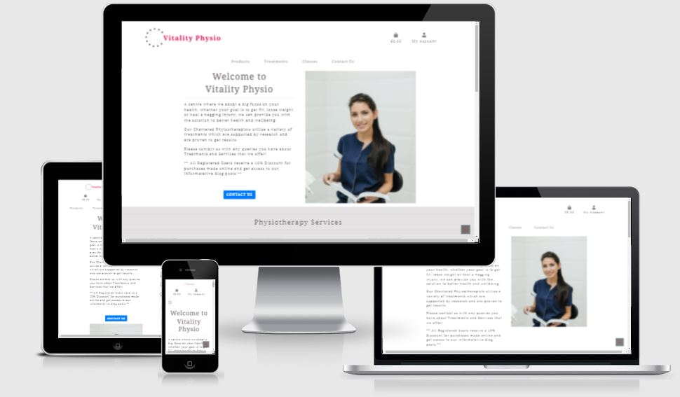
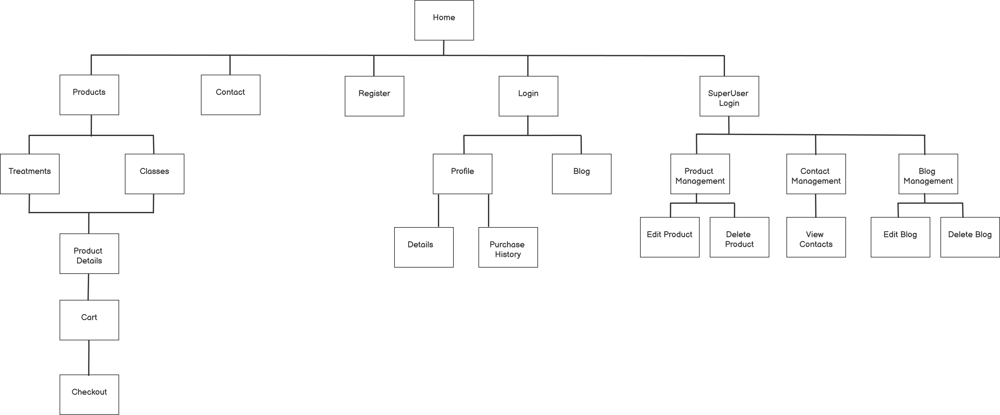

# Milestone Project 4
---
## Purpose

This site was designed for the fourth milestone project in Full Stack Software Development with the Code Institute. The site is based around e-commerce using HTML, CSS, Javascript, JQuery, Python, Django Framework and Postgressql.

---

## Vitality Physio
The idea for this project is all based around a fictional Physiotherapy practice called "Vitality Phyios", with the site showcasing the range of services and treatments that they offer. Users will have the ability to pre-purchase and pay for these services online, with registered users being able to avail of a discount and access to blogs posted by Physiotherapist on a range of topics. The site will also provide a contact page to submit any queries that users may have.

 The live website can be found here: https://

---

## Table of Contents
* [User Experience(UX)](#User-Experience)
    * [User Stories](#User-Stories)
    * [Structure](#Structure)
        * [Database Schema](#Database-Schema)
    * [Design](#Design)
        * [Colour Scheme](#Colour-Scheme)
        * [Imagery](#Imagery)
        * [Wireframes](#Wireframes)
    * [Differences to Design](#Differences-to-Design)
    * [Site Features](#Site-Features)
        * [Features to be Implemented in Future](#Features-to-be-Implemented-in-Future)
* [Technologies Used](#Technologies-Used)
* [Testing](#Testing)
* [Deployment](#Deployment)
    * [GitHub Project Creation](#GitHub-Project-Creation)
    * [Deploy with GitHub Pages](#Deploy-with-Github-Pages)
    * [Locally](Run-Locally)

* [Credits](#Credits)
* [Acknowledgements](#Acknowledgements)

 The live website can be found here: https://

---
### User Experience (UX)

#### User Stories:
*As a Guest User:*
*   I want to immediately understand the nature of the site and learn more about the services that they provided.
*	I want to be able to easily navigate through the site, with the structure of the content easy to follow.
*	I want to be able to access the site from all device types.
*	I want to easily see the treatments and services offered.
*	I want to easily be able to register.
*	I want to be able to easily add my details.
*	I want to be able to contact the Company with any questions I may have in regards treatments and services.

*Registered User:*
*	I want to be able to log onto the website and see my purchase history.
*	I want to be able to edit my details.
*	I want to be easily able to log out of my account.
*	I want to be able to reset my password if it is forgotten.

*Any User:*
*	I want to be able to add items to my shopping cart.
*	I want to be able to remove items from my shopping cart.
*	I want to be able to view my shopping cart and see all items in the cart with price and totals displayed.
*	I want to enter my payment details for purchase of items.
*	I want to be able to reset my password if it is forgotten.
*	I want to get a confirmation email of my purchase.

*Site Owner:*

*	I want to be able to add and remove services on offer to ensure the site is up to date.
*	I want to be easily able edit the details, price and images for services.
*   I want to be able to add, edit and remove blogs on the site.
*   I want to be able to view all contacts made by users

## Structure:

Below is a Site diagram that I used as a basis for the structure of the project:

#### Database Schema:

Below is the database schema that I devised for the project:

## Design:

#### Colour scheme: 
The colour scheme for the site consists of red, white and light grey. The red will be used for the Vitality Physio logo and will carry the branding throughout the site. The overall theme of the site will be clean and clinical to reflect the nature of the business, so the colours will be subtle and minimal. This was also chosen so that the colours are not overwelming and distracting to the users of the site. 

#### Imagery:

 

#### Wireframes:

Here are the wireframes that I used as the basis of the design
for the site. These were created using [Balsamiq](https://balsamiq.com//).

##### Home Page

##### Log In Page

##### Register Page

##### Profile Page

 For the pfd version of the wireframes click [here.](https://)
 

### Differences to Design

## Site Features

Home Page – Details on the business with some details on services and treatments provided
Log in Page – 
Register Page – 
Profile Page – Contains user address and purchase history
Services Page – Display of the Treatments and Classes available
Services Details Page – Display details of a selected Treatment or Class
Class Timetable Page – Timetable of classes for the week
Contact Page – 
Services Admin Page – Site Owner access only. Page for editing or adding treatments and classes for purchase.
Blog Page – Display the reviews that customers have provided for the company and its services.

### Features to be Implemented in Future

* 

---
## Technologies Used
* [HTML5](https://en.wikipedia.org/wiki/HTML5) -  HTML is the main language used for the structure of the site.
* [CSS](https://en.wikipedia.org/wiki/Cascading_Style_Sheets) - Custom written CSS is used to style the site.
* [Materialize](https://materializecss.com/) – The layout and styling of the site was helped by the use of Materialize framework.
* [JavaScript](https://en.wikipedia.org/wiki/JavaScript) - Utilized for form validation
* [jQuery](https://jquery.com/) - Used for various Materialize components such as, Datepicker, Timepicker, Dropdown menu, side navbar, parallax image and modal.
* [Python](https://www.python.org/) - Python is used as the back-end programming language.
* [Flask](https://flask.palletsprojects.com/en/1.1.x/) - Python microframework Flask is used to create this project.
* [Jinja](https://jinja.palletsprojects.com/en/2.11.x/) - Jinja templating language is used with Flask in the HTML code.
* [Werkzeug](https://werkzeug.palletsprojects.com/en/1.0.x/) - Werkzeug is used for password hashing and authentication and autohorization.
* [MobgoDB](https://www.mongodb.com/1) - Database used to create the document based collections for the data storage of this site.
* [Heroku](https://dashboard.heroku.com/) - Hosting platform to deploy the live site.
* [Font Awesome](https://fontawesome.com/) – Was used to obtain the social media icons used.
* [Balsamiq](https://balsamiq.com//)Balsamiq – Was used to create the wireframes of the site on the various devices.
* [Adobe Photoshop Express](https://www.adobe.com/ie/photoshop/online/resize-image.html) - Used to resize images used on the site. 
* [Git](https://git-scm.com/) - Git is used for the version control of changes throughout the project.
* [Gitpod](https://www.gitpod.io/) – was used as the coding space for the project.
* [GitHub](https://github.com/) - was used to host the project files and publish the live website by using Git Pages.
* [Autoprefixer](https://autoprefixer.github.io/) - was used to parse  CSS and add vendor prefixes to CSS rules.
* [W3C Markup Validation Service](https://validator.w3.org/) - W3C Markup Validation Service is used to check whether there were any errors in the HTML5 code.
* [W3C CSS validator](https://jigsaw.w3.org/css-validator/) - The W3C CSS validator is used to check whether there were any errors in the CSS3 code.
* [JShint](https://jshint.com/) - JavaScript validator that is used to check whether there were any errors in the JavaScript code.
* [PEP8](http://pep8online.com/) - The PEP8 validator is used to check whether there were any errors in the Python code.
* [Google Chrome Developer Tools](https://developers.google.com/web/tools/chrome-devtools) – was used extensively during coding to check the responsiveness of the site with the addition of new features.
---

# Testing

The testing process can be found [here](TESTING.md)

# Issues Encountered

* When working on products.html in the products app I had difficulty getting the product images to display. After checking numerous options and searching for spelling mistakes, the answer was found on Slack. I was missing the 'django.template.context_processors.media', in the TEMPLATE 'context_processors' in settings.py.

* When trying to link to AWS I encountered an issue that Heroku would fail in building and deploying giving an error log of ModuleNotFound: No module named 'storages'. I reviewed the steps that I had taken and checked my installs using the command pip list, which showed that django-storages had been installed. In settings.py it had been added correctly to the Installed Apps and I review the requiremnents.txt and it was showing. After many hours of searching the error on Slack and stepping through the process I could not find anything that was done wrong. After leaving the issue overnight and looking at it freah the next day I ran through the same checklist and discovered that on restarting the workspace the requirements.txt was missing items that had previously been showing. Doing a pip3 freeze > requirements.txt and pushing the changes and all worked fine and Heroku was able to connect to AWS.

# Deployment

##  GitHub Project Creation
To create the project the following steps were used:

* In GitHub repositories section click the green 'New' button 
* Select the Code Institute template
* Name the repository and give a brief description
* Set repository to 'Public' to ensure the commit history is visible
* Click 'Create repository'
* Once created the workspace is built in Gitpod by clicking the Gitpod button.

## Deploy to Heroku
The website was deployed as follows:

* Navigate to Heroku.com and login.
* Click on the new button.
* Select create new app.
* Enter the app name.
* Select region.

Set up connection to Github Repository:

* Click the deploy tab and select GitHub - Connect to GitHub.
* A prompt to find a github repository to connect to will then be displayed.
* Enter the repository name for the project and click search.
* Once the repo has been found, click the connect button.

Set environment variables:

Click the settings tab and then click the Reveal Config Vars button and add the following:
* key: IP, value: 0.0.0.0
* key: PORT, value: 5000
* key: MONGO_DBNAME, value: (database name you want to connect to)
* key: MONGO_URI, value: (mongo uri - This can be found in MongoDB by going to clusters > connect > connect to your application and substituting the password and dbname that you set up in the link).
* key: SECRET_KEY, value: (This is a custom secret key set up for configuration to keep client-side sessions secure).

Enable automatic deployment:

* Click the Deploy tab
* In the Automatic deploys section, choose the branch you want to deploy from then click Enable Automation Deploys.

## Run Locally

To run the code locally:

* Navigate to the repository
* Click the 'Code' drop down menu
* Select to copy the GitHub URL from HTTPS box or 'Download Zip'
* Open a new terminal and type 'git clone' command in the CLI and paste copied URL
* Alternatively, click 'Open with GitHub Desktop' and follow the steps to complete the clone

Once the project has been loaded, run the command 
> pip install -r requirements.txt 

  to install all the required packages.

The project will not run locally with database connections unless the user sets up an env.py file configuring 
IP, PORT, MONGO_URI, MONGO_DBNAME and SECRET_KEY. You must have the connection details in order to do this. 
These details are private and not disclosed in this repository for security purposes.

---

# Credits

### Media

  
### Code

* The Boutique Ado walk through project by Code Institute was used as an excellent starting point for this project. Much of the structure of the project was based around this and was adapted, 
modified and expanded to suit the functionality of the porject.

* Code for scrolling content of bootstrap card found on Stackoverflow and modified to meet my needs: https://stackoverflow.com/questions/49818715/scrollable-card-bootstrap

---

# Acknowledgments

* My Mentor, Precious Ijege , for his feedback and support throughout the project.

* The Slack community for their support, encouragement and assistance in finding answers 
to my project problems.
