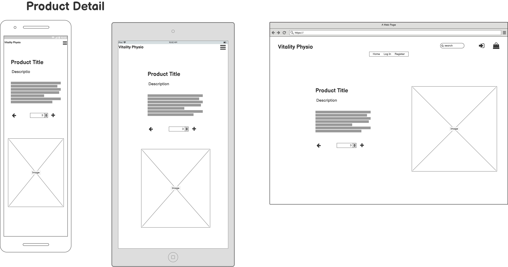

# Milestone Project 4
---
## Purpose


This site was designed for the fourth milestone project in Full Stack Software Development with the Code Institute. The site is based around e-commerce using HTML, CSS, Javascript, JQuery, Python, Django Framework and Postgressql.


---

## Vitality Physio
The idea for this project is all based around a fictional Physiotherapy practice called "Vitality Phyios", with the site showcasing the range of services and treatments that they offer. Users will have the ability to pre-purchase and pay for these services online, with registered users being able to avail of a discount and access to blogs posted by Physiotherapist on a range of topics. The site will also provide a contact page to submit any queries that users may have.

 The live website can be found here: https://smeghen-vitality-physio.herokuapp.com/

---


## Table of Contents
* [User Experience(UX)](#User-Experience)
    * [User Stories](#User-Stories)
    * [Structure](#Structure)
        * [Database Schema](#Database-Schema)
    * [Design](#Design)
        * [Colour Scheme](#Colour-Scheme)
        * [Imagery](#Imagery)
        * [Wireframes](#Wireframes)
    * [Differences to Design](#Differences-to-Design)
    * [Site Features](#Site-Features)
        * [Features to be Implemented in Future](#Features-to-be-Implemented-in-Future)
* [Technologies Used](#Technologies-Used)
* [Testing](#Testing)
* [Deployment](#Deployment)
    * [GitHub Project Creation](#GitHub-Project-Creation)
    * [Deploy with GitHub Pages](#Deploy-with-Github-Pages)
    * [Locally](Run-Locally)

* [Credits](#Credits)
* [Acknowledgements](#Acknowledgements)


 The live website can be found here: https://smeghen-vitality-physio.herokuapp.com/


---
### User Experience (UX)

#### User Stories:
*As a Guest User:*
*   I want to immediately understand the nature of the site and learn more about the services that they provided.
*	I want to be able to easily navigate through the site, with the structure of the content easy to follow.
*	I want to be able to access the site from all device types.
*	I want to easily see the treatments and services offered.
*	I want to easily be able to register.
*	I want to be able to easily add my details.
*	I want to be able to contact the Company with any questions I may have in regards treatments and services.


*Registered User:*
*	I want to be able to log onto the website and see my purchase history.
*	I want to be able to edit my details.
*	I want to be easily able to log out of my account.
*	I want to be able to reset my password if it is forgotten.

*Any User:*
*	I want to be able to add items to my shopping cart.
*	I want to be able to remove items from my shopping cart.
*	I want to be able to view my shopping cart and see all items in the cart with price and totals displayed.
*	I want to enter my payment details for purchase of items.
*	I want to get a confirmation email of my purchase.

*Site Owner:*

*	I want to be able to add services on offer to ensure the site is up to date.
*	I want to be easily able edit and delete the details, price and images for services.
*   I want to be able to add, edit and remove blogs on the site.
*   I want to be able to view all contacts made by users


## Structure:


Below is a Site diagram that I used as a basis for the structure of the project:


#### Database Schema:

Django works with SQL databases and I utilised SQLite in the development envirnoment, and PostgreSQL database on Heruko for the deployed site.


### User Model

The User model utilized for this project is the standard one provided by `django.contrib.auth.models`

### Profiles App

| Name | Database Key | Field Type | Type Validation |
| :-------------: |:----------------:| :--------------: | :---------: |
|User | user |	OneToOneField 'User'| on_delete=models.CASCADE
|Default Street Address1 | default_street_address1 | CharField | max_length=80, null=True, blank=True
|Default Street Address2 | default_street_address2 | CharField | max_length=80, null=True, blank=True
|Default Town or City | default_town_or_city | CharField | max_length=40, null=True, blank=True
|Default County | default_county | CharField | max_length=80, null=True, blank=True
|Default Postcode | default_postcode | CharField | max_length=20, null=True, blank=True
|Default Phone Number |	default_phone_number | CharField | max_length=20, null=True, blank=True


### Products App

`Category` model

| Name | Database Key | Field Type | Type Validation |
| :-------------: |:----------------:| :--------------: | :---------: |
|Name | name | CharField | max_length=254


`Product` model

| Name | Database Key | Validation | Field Type|
| :-------------: |:----------------:| :--------------: | :---------: |
|Category | category | 'Catergory', null=True, blank=True, on_delete=models.SET_NULL| ForeignKey
|Product id | id | primary_key=True | AutoField
|Name | name | max_length=254 | CharField
|SKU | sku | max_length=254, null=True, blank=True | CharField
|Description | content | blank=False | TextField
|Price | price | max_digits=6, decimal_places=2 | DecimalField
|Image| image| blank=False | ImageField


### Blog App

| Name | Database Key | Validation | Field Type|
| :-------------: |:----------------:| :--------------: | :---------: |
|Author | author | max_length=80, null=True, blank=False | CharField
|Subject | subject | max_length=255, null=True, blank=False | CharField
|Content | content | max_length=2000, null=True, blank=False | TextField

### Contact App

| Name | Database Key | Validation | Field Type|
| :-------------: |:----------------:| :--------------: | :---------: |
|Email | email | max_length=80, null=True, blank=False | EmailField
|Subject | subject | max_length=255, null=True, blank=False | CharField
|Message | messaage | max_length=1500, null=True, blank=False | TextField

### Checkout App

`Order` model

| Name | Database Key | Validation | Field Type|
| :-------------: |:----------------:| :--------------: | :---------: |
|Order Number | order_number | (max_length=32, null=False, editable=False | CharField
|User Profile | user_profile | UserProfile, on_delete=models.SET_NULL, null=True, blank=True, related_name='orders' | ForeignKey(User)
|Full name | full_name | max_length=50, null=False, blank=False | CharField
|Phone number | phone_number | max_length=20, null=False, blank=False | CharField
|Postcode | postcode| max_length=20, null=True, blank=True | CharField
|Town or City | town_or_city | max_length=40, null=False, blank=False | CharField
|Street address 1 | street_address1 | max_length=80, null=False, blank=False| CharField
|Street address 2 | street_address2 | max_length=80, null=True, blank=True | CharField
|County | county | max_length=40, blank=False | CharField
|Date | date | auto_now_add=True | DateTimeField
|Order Total | order_total | max_digits=10, decimal_places=2, null=False, default=0 | DecimalField
|Discount | discount | max_digits=2, decimal_places=2, null=False, default=0 | DecimalField
|Grand Total | grand_total | max_digits=10, decimal_places=2, null=False, default=0 | DecimalField
|Original Cart | original_cart |null=False, blank=False, default='' | TextField
|Stripe PID | stripe_pid | max_length=254,null=False, blank=False, default='' | CharField


`OrderLineItem` model

| Name | Database Key | Validation | Field Type|
| :-------------: |:----------------:| :--------------: | :---------: |
|Order | order | Order, null=False, blank=False, on_delete=models.CASCADE, related_name='lineitems'| ForeignKey
|Product | product | Product, null=False, blank=False, on_delete=models.CASCADE | ForeignKey
|Quantity | quantity |  null=False, blank=False, default=0 | IntegerField
|Line Item Total | lineitem_total | max_digits=6, decimal_places=2, null=False, blank=False, editable=False | DecimalField

## Design:

#### Colour scheme: 
The colour scheme for the site consists of red, white and light grey. The red will be used for the Vitality Physio logo and will carry the branding throughout the site. The overall theme of the site will be clean and clinical to reflect the nature of the business, so the colours will be subtle and minimal. This was also chosen so that the colours are not overwelming and distracting to the users of the site. 


#### Imagery:

I have used a range of images for this project that I have sourced from Pixel, Unsplash and iStockPhoto. Ideally for a real business it would be better to use actual pictures of
staff, classes, treatments and facilities, but these can always be added at a later date. The images I used I tried to select ones that best convey the clinical nature of the business and also are easily associated with the products and services that they are related too.


#### Wireframes:

Here are the wireframes that I used as the basis of the design
for the site. These were created using [Balsamiq](https://balsamiq.com//).

##### Home Page


##### Treatments & Classes


##### Product Details



##### Profile Page


##### Shopping Cart Page


 

### Differences to Design

* During development and testing I found that the use of a hero image was not adequately able to convey the purpose of the site. The images that I was using were not able to capture the nature of the 
business of a Phyiotherapy practice, so I decided to incorporate text along side an image to better aid first time users understanding the purpose of the site. I thought this was especially important for smaller screen
sizes, where a user would need to scroll down before finding any details on what the site is about.


## Site Features

Each page of the site has a responsive navbar which contains the company logo on the top left and links to Account access and Shopping Cart on the right. There is also a simple Footer on each page with links to social media and copyright information.

The navigation links of the navbar are for Products, Treatments, Classes and Contact Us, with the Blog link only visible to Registered Users.


### Home Page 

There are 4 sections to the Home page. 

*About section* - has a brief outline of the site and the business, with a link to the Contact page and image of a Physiotherapist.

*Phyisotherapy Service* - Section hightlighting the different services provided.

*Classes* - Section showing the classes provided.

*Healthcare Providers* - Section with links to Healthcare Providers that the business is cover by.

### Products App
*Product* - This section displays all the products available to purchase on the site. They are displayed as simple cards images with the name and price shown over the image. The nav links of Treatments and Classes act as a filter to display the corresponding products.

*Product Details* - This option displays more details of the product and provides the options to Add to cart. 

*Product Management* - For authenticated Super Users the options to Edit or Delete a product are diplayed on the Product Details. The addition of a new product can be accessed from the Navbar - My Account - Product Management link.

### Contact App

A contact form for any User to submit any queries that they have. Each contact is posted to the database rather than being sent by email, as I feel that it is a better way of tracking contacts as emails can be overlooked. Authenticated Users can view all contacts from the Navbar - My Account - Contact Management.

### Profile App

The User profile can be accessed from the Navbar - My Account - My Profile. Here the saved Shipping information is displayed and can be edited as required. Also displayed is the Order History of the User.

### Blog App

*Blog*  - Registered Users can view the Blogs posted by Physiotherapists.

*Blog Management* - For authenticated Super Users the options to Edit or Delete aBlog are diplayed under the title of each blog.. The addition of a new blog can be accessed from the Navbar - My Account - Blog Management link.

### Cart App

Everytime a product is added to the cart, the cart is updated on the Navbar with the Total. Navigating to the Cart all items that have been placed in the cart will be displayed with Name, price, quantity and total. Adjustments to the items in the cart can be made such as update quantity or removed from cart.

### Checkout App

Here a User can verify their personal details and payment information, For Registered Users a discount will be applied to the order total. The Card Payment is managed using Stripe, which validates the card and manages the security of the payment.

### Allauth

Django-Allauth is the integrated Django application used for the registration and account management of Users. Features that are utilized for this site are signup, login, logout and password management. These features are tied into the automatic email generation that users recieve for account verification, password reset and order confirmation. 


### Features to be Implemented in Future

* Setup a booking system so that Users cannot only purchased treatments and classes, but can also book times for their selected services.
* Added in more details to the specifc treatments displayed on the Home page.
* For the Contact Management add more functionality with the options to add response sent to User, date of response and status such as open, closed, etc.


---
## Technologies Used
- This project was built primarily using HTML5 semantic markup, CSS stylesheets, Javascript, Python, Django, SQLite and Heroku Postgres.

* [Python](https://www.python.org/) - Python is used as the back-end programming language.
    - The following Python modules were used on this project:
        - asgiref==3.4.1
        - boto3==1.20.11
        - botocore==1.23.11
        - dj-database-url==0.5.0
        - Django==3.2.8
        - django-allauth==0.41.0
        - django-crispy-forms==1.13.0
        - django-storages==1.12.3
        - gunicorn==20.1.0
        - jmespath==0.10.0
        - oauthlib==3.1.1
        - Pillow==8.3.2
        - psycopg2-binary==2.9.2
        - pylint-django==2.4.4
        - pylint-plugin-utils==0.6
        - python3-openid==3.2.0
        - pytz==2021.3
        - requests-oauthlib==1.3.0
        - s3transfer==0.5.0
        - sqlparse==0.4.2
        - stripe==2.61.0

* [HTML5](https://en.wikipedia.org/wiki/HTML5) -  HTML is the main language used for the structure of the site.
* [CSS](https://en.wikipedia.org/wiki/Cascading_Style_Sheets) - Custom written CSS is used to style the site.
* [Bootstrap](https://getbootstrap.com/) – The layout and styling of the site was helped by the use of Bootstrap framework.
* [JavaScript](https://en.wikipedia.org/wiki/JavaScript) - Used to implement Stripe.
* [Django](https://www.djangoproject.com/) - This project was created using the Python framework Django.
* [PostgreSQL](https://www.postgresql.org/) - Used to create the relational databases in conjunction with Heroku.
* [Heroku](https://dashboard.heroku.com/) - Hosting platform to deploy the live site.
* [SQLite](https://www.sqlite.org/index.html)- SQLite was used as the database for the creation and development of this project.
* [Jinja](https://jinja.palletsprojects.com/en/3.0.x/) - Jinja was used for templating.
* [Stripe](https://stripe.com/ie) - Stripe payments were used to build the card payment system of this site.
* [Font Awesome](https://fontawesome.com/) – Was used to obtain the social media icons used.
* [Balsamiq](https://balsamiq.com//)Balsamiq – Was used to create the wireframes of the site on the various devices.
* [Adobe Photoshop Express](https://www.adobe.com/ie/photoshop/online/resize-image.html) - Used to resize images used on the site. 
* [Git](https://git-scm.com/) - Git is used for the version control of changes throughout the project.
* [Gitpod](https://www.gitpod.io/) – was used as the coding space for the project.
* [GitHub](https://github.com/) - was used to host the project files and publish the live website by using Git Pages.
* [Autoprefixer](https://autoprefixer.github.io/) - was used to parse  CSS and add vendor prefixes to CSS rules.
* [W3C Markup Validation Service](https://validator.w3.org/) - W3C Markup Validation Service is used to check whether there were any errors in the HTML5 code.
* [W3C CSS validator](https://jigsaw.w3.org/css-validator/) - The W3C CSS validator is used to check whether there were any errors in the CSS3 code.
* [JShint](https://jshint.com/) - JavaScript validator that is used to check whether there were any errors in the JavaScript code.
* [PEP8](http://pep8online.com/) - The PEP8 validator is used to check whether there were any errors in the Python code.
* [Google Chrome Developer Tools](https://developers.google.com/web/tools/chrome-devtools) – was used extensively during coding to check the responsiveness of the site with the addition of new features.
---

# Testing

The testing process can be found [here](TESTING.md)


# Deployment

##  GitHub Project Creation
To create the project the following steps were used:

* In GitHub repositories section click the green 'New' button 
* Select the Code Institute template
* Name the repository and give a brief description
* Set repository to 'Public' to ensure the commit history is visible
* Click 'Create repository'
* Once created the workspace is built in Gitpod by clicking the Gitpod button.


## Deploy to Heroku
Before deploying the website to Heroku, the following steps must be followed to allow the app to work in Heroku:
* Create requirements.txt file that contains the names of packages being used in Python. It is important to update this file if other packages or modules are installed during project development by using the following command:

    - pip freeze --local > requirements.txt

* Create Procfile that contains the name of the application file so that Heroku knows what to run. If the Procfile has a blank line when it is created remove this as this may cause problems.

* Push these files to GitHub.

* Install `psycopg2` and `dj_datatbase_url` in your workspace cli.

Once those steps are done, the website can be deployed in Heroku using the steps listed below:

* Navigate to Heroku.com and login.
* Click on the new button.
* Select create new app.
* Enter the app name.
* Select region.

Set up connection to Github Repository:

* Click the deploy tab and select GitHub - Connect to GitHub.
* A prompt to find a github repository to connect to will then be displayed.
* Enter the repository name for the project and click search.
* Once the repo has been found, click the connect button.

Set environment variables:

Click the settings tab and then click the Reveal Config Vars button and add the following:
* DATABASE_URL
* EMAIL_HOST_PASS
* EMAIL_HOST_USER
* SECRET_KEY
* STRIPE_PRICE_ID
* STRIPE_PUBLIC_KEY
* STRIPE_SECRET_KEY
* STRIPE_WH_SECRET
* AWS_ACCESS_KEY_ID
* AWS_SECRET_ACCESS_KEY
* USE_AWS

Enable automatic deployment:

* Click the Deploy tab
* In the Automatic deploys section, choose the branch you want to deploy from then click Enable Automation Deploys.

### Setting up the AWS s3 bucket
* Create an Amazon AWS account
* Search for S3 and create a new bucket
    - Allow public access
* Under Properties > Static website hosting
    - Enable
    - index.html as index.html
    - save
* Under Permissions > CORS use the following:
```
[
  {
      "AllowedHeaders": [
          "Authorization"
      ],
      "AllowedMethods": [
          "GET"
      ],
      "AllowedOrigins": [
          "*"
      ],
      "ExposeHeaders": []
  }
]
```
* Under Permissions > Bucket Policy:
    - Generate Bucket Policy and take note of Bucket ARN
    - Chose S3 Bucket Policy as Type of Policy
    - For Principal, enter *
    - Enter ARN noted above
    - Add Statement
    - Generate Policy
    - Copy Policy JSON Document
    - Paste policy into Edit Bucket policy on the previous tab
    - Save changes
* Under Access Control List (ACL):
    - For Everyone (public access), tick List
    - Accept that everyone in the world may access the Bucket
    - Save changes

**AWS IAM (Identity and Access Management) setup**
* From the IAM dashboard within AWS, select User Groups:
    - Create a new group
    - Click through and Create Group
* Select Policies:
    - Create policy
    - Under JSON tab, click Import managed policy
    - Choose AmazongS3FullAccess
    - Edit the resource to include the Bucket ARN noted earlier when creating the Bucket Policy
    - Click next step and go to Review policy
    - Give the policy a name and description of your choice
    - Create policy
* Go back to User Groups and choose the group created earlier
    - Under Permissions > Add permissions, choose Attach Policies and select the one just created
    - Add permissions
* Under Users:
    - Choose a user name 
    - Select Programmatic access as the Access type
    - Click Next
    - Add the user to the Group just created
    - Click Next and Create User
* Download the `.csv` containing the access key and secret access key.
    - **THE `.csv` FILE IS ONLY AVAILABLE ONCE AND CANNOT BE DOWNLOADED AGAIN.**

**Connecting Heroku to AWS S3**
* Install boto3 and django-storages
```
pip3 install boto3
pip3 install django-storages
pip3 freeze > requirements.txt
```
* Add the values from the `.csv` you downloaded to your Heroku Config Vars under Settings:
* Delete the `DISABLE_COLLECTSTATIC` variable from your Cvars and deploy your Heroku app
* With your S3 bucket now set up, you can create a new folder called media (at the same level as the newly added static folder) and upload any required media files to it.
    - **PLEASE MAKE SURE `media` AND `static` FILES ARE PUBLICLY ACCESSIBLE UNDER PERMISSIONS**


## Run Locally

To run the code locally:

* Navigate to the repository
* Click the 'Code' drop down menu
* Select to copy the GitHub URL from HTTPS box or 'Download Zip'
* Open a new terminal and type 'git clone' command in the CLI and paste copied URL
* Alternatively, click 'Open with GitHub Desktop' and follow the steps to complete the clone

Once the project has been loaded, run the command 
> pip install -r requirements.txt 

  to install all the required packages.


---


# Credits

### Media


  
### Code


* The Boutique Ado walk through project by Code Institute was used as an excellent starting point for this project. Much of the structure of the project was based around this and was adapted, 
modified and expanded to suit the functionality of the project.

* Code for scrolling content of bootstrap card found on Stackoverflow and modified to meet my needs: https://stackoverflow.com/questions/49818715/scrollable-card-bootstrap


---

# Acknowledgments

* My Mentor, Precious Ijege , for his feedback and support throughout the project.

* The Slack community for their support, encouragement and assistance in finding answers 
to my project problems.
