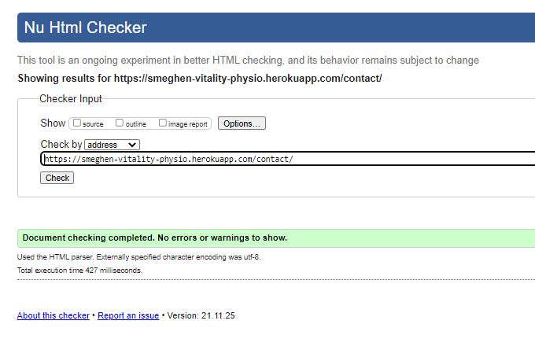
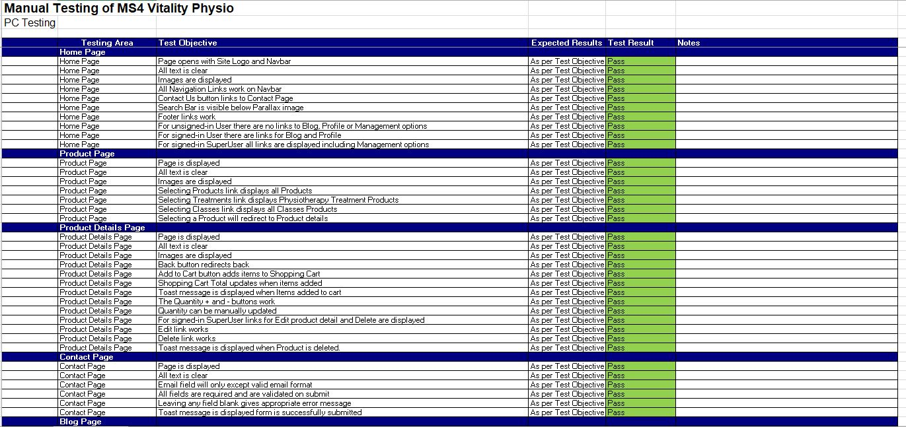
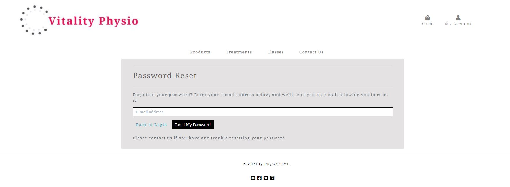

# Testing

## Table of Contents

* [Validators](Validators)
* [Manual Testing](#Manual-Testing)
* [User Stories Testing](#User-Stories-Testing)
* [User Testing](#User-Testing)
* [Issues Encountered](#Issues-Encountered)

---

## Validators

### HTML

  All the following HTML pages were validated with [W3C Markup Validation Service](https://validator.w3.org/)
* Home Page

    

* Products Page

    

* Product Details Page

    

* Contact Page

    

* Blog Page

    

* Cart Page

    

* Checkout Page

    

* Checkout Success Page

    

* Add Product Page

    

* Edit Product Page

    

* Add Blog Page

    

* Edit Blog Page

    

* View Contacts Page

    

* Profile Page

    

* Login Page

    

* Logout Page

    

* Register Page

    

### CSS

CSS was validated by using W3C Jigsaw CSS Validation Service [W3C Jigsaw CSS Validation Service](https://jigsaw.w3.org/css-validator/)

### Javascript

Javascript code was passed through[JShint](https://jshint.com/) and no errors were found.

### Python

All files passed through the [PEP8](http://pep8online.com/) validator without errors, except for settings.py file. This file has pieces of code that were auto generated by Django and I was relucant to make changes as the code was working.

--- 

## Manual Testing

The following browsers were used to test the website – Google Chrome, Microsoft Edge and Safari.

For the testing of this project I devised a spreadsheet detailing the tests to be performed for the various pages and features.
Below is an image of a small section of this spreadsheet:

The full version of the spreadsheet can be downloaded [here.](https://github.com/smeghen/vitality-physio/media/TESTING-Images/MS4_Testing.xlsx)

Please note this is a .xlsx file and will require excel, google docs or compatiable program to open the file.
The testing was performed on PC, Tablet and Mobile devices and all tests passed. I have shown in the spreadsheet the tests
that caused issues and have included notes in relation to these.

---

## User Stories Testing

### Guest User

> I want to immediately understand the nature of the site and learn more about how to use it.
* This is addressed in the short site description that is displayed on the Home page beside the image of a physiotherapist.

> I want to be able to easily navigate through the site, with the structure of the content easy to follow.
* I kept the navigation of the site easy to use by duplicating the links on the navbar with buttons and having them located logically throughout the site, e.g. there is a Contact link both in the navbar, footer and on the Home page welcome section.

> I want to be able to access the site from all device types.
* The site was designed using the mobile first approach with the specfic understanding that the majority of users would be accessing the site on either tablets or mobile phones. 

> I want to easily see the treatments and services offered.
* On the Navbar I have 3 options for view products. Products - shows all products available. Treatments - shows all physiotherapy treatments. Classes - shows all classes. 

> I want to easily be able to register.
* Register link is located on the navbar under the My Account icon and this appears on all pages of the site.

> I want to be able to easily add my details.
* A Guest User is able to make a purchase without having to register and can add their details on the Checkout Page so that their details are record against their order.

> I want to be able to contact the Company with any questions I may have in regards treatments and services.
* Any User can easily pass on questions they have by filling in the Contact form on the site and submitting it.

### Registered User

> I want to be able to log onto the website and see my purchase history.

> I want to be able to edit my details.
* Once a Registered User is logged into the site, they can navigate to their Profile page which is located under the My Account icon and this appears on all pages of the site. On this page they have the option to edit their details and also view their purchase history.

> I want to be easily able to log out of my account.
* Under the My Account icon which appears on all pages of the site is the link to Logout of the site.

> I want to be able to reset my password if it is forgotten.
* On the Login page there is a link to Forgot Password page, then the User can enter their email address and a link will be sent to them that will allow them to create a new password.

### Any User

> I want to be able to add items to my shopping cart.
* When a user finds a product they like they can select that item and be brought to the item details page. On this page the user has the options to select they quantity the want and then add it to their shopping cart.

> I want to be able to remove items from my shopping cart.

> I want to be able to view my shopping cart and see all items in the cart with price and totals displayed.

* A User is able to access their Shopping cart from the Bag icon at the top of all pages. On this page will be displayed the items, price and totals in the cart. Here they can change the quantity of items in their cart or delete them. 

> I want to enter my payment details for purchase of items.

* From the Cart page a User can proceed to Checkout using the button at the bottom of the cart summary. On the Checkout page they can fill in the form with the payment details which will be validated

> I want to get a confirmation email of my purchase.

* Once Confirm Payment has been selected on Checkout and Stripe has validated the payment a confirmation email will be sent to the Users email with confirmation details of the purchase.

### Site Owner

> I want to be able to add and remove services on offer to ensure the site is up to date.

* When the Site Owner is logged in as a SuperUser they have the option to Add products to the site by navigating to the My Account icon and select the Product Management link. This will bring them to Add Product page were the details of the product can up added.

> I want to be easily able edit and delete the details, price and images for services.

* When the Site Owner is logged in as a SuperUser the options to Delete or Edit a product become visible on the individual Product Details page. Selecting Delete will delete the Product from the site. Selecting Edit will bring the user to Edit Product page changes can be made.

> I want to be able to add, edit and remove blogs on the site.

* When the Site Owner is logged in as a SuperUser the options to Delete or Edit a Blog become visible under the title of individual blogs on the Blogs page. Selecting Delete will delete the Blog from the site. Selecting Edit will bring the user to Edit Blog page changes can be made. To Add Blogs to the site navigate to the My Account icon and select the Blog Management link. This will bring them to Add Blog page were the details of the Blog can up added.

> I want to be able to view all contacts made by users

* When the Site Owner is logged in as a SuperUser they have the option to View Contacts to the site by navigating to the My Account icon and select the Contact Management link. This will bring them to View Contacts page were all the contacts will be displayed.

---

## User Testing

Family members, peers of Slack and friends were asked to test the website and provide their thoughts on the user 
experience and any bugs that they found. Within this group of people the site was viewed on the following devices
 – Desktop, Laptop, iPad mini, iPad, iPhone 6, iPhone 8, Samsung Galaxy S6 and Huawei P30.

* Some feedback that I received was in relation to the Checkout page and the layout of the address form. Originally I had put it in without any particular thought to the sequence of the fields. I have since rearrange the fields so that they are logically in relation to a postal address.

* It was spotted that I had $, £ and € symbols in various places for price throughout the site, this was easily rectified by locating the symbols and updating the all to €.

* On smaller screens it was found that the text on the Home page About section was overflowing and being lost, this was fixed by adding padding to the container so that the text would always be pushed away from the edges of the container.

---

## Issues Encountered 

* When working on products.html in the products app I had difficulty getting the product images to display. After checking numerous options and searching for spelling mistakes, the answer was found on Slack. I was missing the 'django.template.context_processors.media', in the TEMPLATE 'context_processors' in settings.py.

* When trying to link to AWS I encountered an issue that Heroku would fail in building and deploying giving an error log of ModuleNotFound: No module named 'storages'. I reviewed the steps that I had taken and checked my installs using the command pip list, which showed that django-storages had been installed. In settings.py it had been added correctly to the Installed Apps and I reviewed the requiremnents.txt and it was showing. After many hours of searching the error on Slack and stepping through the process I could not find anything that was done wrong. After leaving the issue overnight and looking at it fresh the next day I ran through the same checklist and discovered that on restarting the workspace the requirements.txt was missing items that had previously been showing. Doing a pip3 freeze > requirements.txt and pushing the changes and all worked fine and Heroku was able to connect to AWS.

---

[Go to README.md file](README.md).

---

